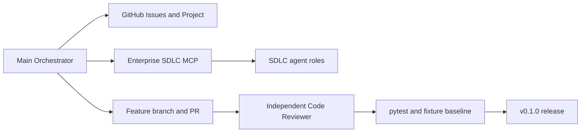

# Support Ticket Triage Assistant

**Portfolio case study:** GitHub-first, agent-assisted SDLC — thin vertical slices, independent agent code review, pytest + eval baselines, CI, release. The NorthPeak Audioworks triage demo is the **proof the process ran**, not the thesis.

> **New here?** Start with the [**5-stop portfolio tour**](docs/00_project/PORTFOLIO_TOUR.md) → [`DELIVERY_RECORD.md`](docs/00_project/DELIVERY_RECORD.md) → example PRs [#38](https://github.com/raghuram-chittibomma/support-ticket-triage-assistant/pull/38) · [#43](https://github.com/raghuram-chittibomma/support-ticket-triage-assistant/pull/43) · [#51](https://github.com/raghuram-chittibomma/support-ticket-triage-assistant/pull/51) · [v0.1.0 release](https://github.com/raghuram-chittibomma/support-ticket-triage-assistant/releases/tag/v0.1.0)

An AI-assisted support ticket triage demo built for **NorthPeak Audioworks**, a fully fictional premium hi-fi audio company.

> **Status:** **v0.1.0 released** (2026-07-03). Delivery index: [`DELIVERY_RECORD.md`](docs/00_project/DELIVERY_RECORD.md).

## What this project is

Customer support agents at NorthPeak Audioworks receive tickets about Wi-Fi setup, Bluetooth pairing, firmware updates, speaker/amp issues, subwoofer pairing, shipping, returns, warranty, and more. This assistant takes a raw ticket description and returns:

- Ticket category and priority
- Readiness assessment (is there enough information to act on the ticket?)
- Likely issue and suggested next action
- A suggested customer response, grounded in synthetic knowledge-base references
- A confidence level and human-review flag

All product, customer, ticket, and knowledge-base data in this repository is **synthetic**. Nothing here represents a real company, real customers, or real proprietary content.

## Delivery (portfolio focus)

Backlog, PRs, and release facts live in **GitHub** — not duplicated in local markdown. [`DELIVERY_RECORD.md`](docs/00_project/DELIVERY_RECORD.md) is a close-out index with links, dates, and metrics from git/GitHub. [`PORTFOLIO_TOUR.md`](docs/00_project/PORTFOLIO_TOUR.md) is the guided path for external reviewers.



| Track | Where to look |
|-------|----------------|
| **Guided tour** | [`PORTFOLIO_TOUR.md`](docs/00_project/PORTFOLIO_TOUR.md) |
| Backlog and status | [Issues](https://github.com/raghuram-chittibomma/support-ticket-triage-assistant/issues) · [Project board](https://github.com/users/raghuram-chittibomma/projects) |
| Per-slice facts | [`RELEASE_NOTES.md`](docs/03_operations/RELEASE_NOTES.md) (includes reviewer findings) |
| Eval baselines | [`evals/baselines/`](evals/baselines/) · [`QUALITY_BAR.md`](evals/baselines/QUALITY_BAR.md) |
| Build-time agents | [`enterprise_sdlc_mcp/`](enterprise_sdlc_mcp/) · [`AGENTS.md`](AGENTS.md) |

## Start here

- [`docs/00_project/PORTFOLIO_TOUR.md`](docs/00_project/PORTFOLIO_TOUR.md) — **external reviewers start here** (5-stop tour).
- [`docs/00_project/DELIVERY_RECORD.md`](docs/00_project/DELIVERY_RECORD.md) — v0.1 delivery index.
- [`docs/00_project/AI_ORCHESTRATOR_BRIEF.md`](docs/00_project/AI_ORCHESTRATOR_BRIEF.md) — operating rules (AI agents: read this first).
- [`docs/00_project/PROJECT_CHARTER.md`](docs/00_project/PROJECT_CHARTER.md) — goals, scope, stakeholders.
- [`docs/00_project/PRODUCT_BRIEF.md`](docs/00_project/PRODUCT_BRIEF.md) — personas, requirements, taxonomy.
- [`docs/01_architecture/ARCHITECTURE.md`](docs/01_architecture/ARCHITECTURE.md) — runtime architecture.

## Quick run (demo product)

Requires `OPENAI_API_KEY` in `.env` (see `.env.example`).

```bash
pip install -e ".[dev]"
python -m src.ui          # Gradio demo
# or: uvicorn src.api.main:app --reload   # FastAPI POST /triage
pytest -m "not llm"       # fast test suite (same as CI)
```

Full ops: [`docs/03_operations/RUNBOOK.md`](docs/03_operations/RUNBOOK.md).

## Repository layout

```
docs/         durable engineering & project docs
src/          runtime application (pipeline, API, Gradio UI)
tests/        pytest unit/integration tests
evals/        evaluation runner + release baselines under evals/baselines/
data/         synthetic catalog, tickets, knowledge base
enterprise_sdlc_mcp/  Enterprise SDLC MCP server (build-time, not runtime)
.skills/      domain overlay skills only
.github/      issue/PR templates and CI workflows
```

## Tech stack

Python 3.12+, FastAPI, Gradio, Pydantic, pytest, OpenAI (classification explanation + response drafting), file-based synthetic data (PostgreSQL deferred per ADR-001).

## License

[MIT](LICENSE)
