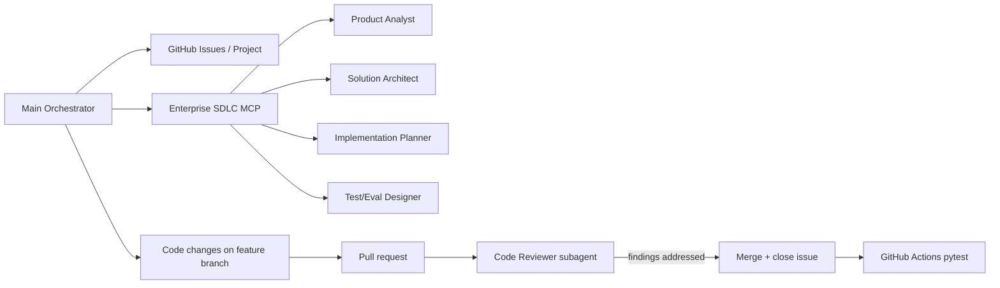

# Delivery record — v0.1 close-out

| Field | Value |
|---|---|
| **Purpose** | Index how this repo was delivered for portfolio readers; not a substitute for GitHub Issues/PRs |
| **Added** | 2026-07-03, after [v0.1.0](https://github.com/raghuram-chittibomma/support-ticket-triage-assistant/releases/tag/v0.1.0) |
| **Source of truth for status** | [GitHub Issues](https://github.com/raghuram-chittibomma/support-ticket-triage-assistant/issues) and [Project board](https://github.com/users/raghuram-chittibomma/projects) |

This document consolidates delivery facts that already exist in git history and GitHub. It was written at milestone close-out so a reviewer does not have to reconstruct the SDLC story from twelve separate PR descriptions.

## What was being demonstrated

The **primary portfolio artifact** is the delivery process: GitHub-first backlog, thin vertical slices, independent agent review, tests + evals, CI, release. The NorthPeak Audioworks triage demo is the vehicle, not the thesis.

## Two programs in one repository

| Program | Milestone / label | Outcome |
|---------|-------------------|---------|
| **Triage product demo** | `v0.1 SDLC Demo` | Pipeline, API, Gradio UI, eval runner — [release v0.1.0](https://github.com/raghuram-chittibomma/support-ticket-triage-assistant/releases/tag/v0.1.0) |
| **Enterprise SDLC MCP** | `program:enterprise-sdlc` | Reusable build-time agents/skills via MCP — [PR #51](https://github.com/raghuram-chittibomma/support-ticket-triage-assistant/pull/51) |

The MCP program was spun up mid-stream (2026-07-03) and dogfooded for pre-merge review from [PR #53](https://github.com/raghuram-chittibomma/support-ticket-triage-assistant/pull/53) onward.

## Timeline (from git)

| Date | Event |
|------|-------|
| 2026-07-02 | SDLC foundation commit; story layer; independent review rule |
| 2026-07-02 | Slices 1–2 merged ([#38](https://github.com/raghuram-chittibomma/support-ticket-triage-assistant/pull/38), [#40](https://github.com/raghuram-chittibomma/support-ticket-triage-assistant/pull/40)) |
| 2026-07-03 | Slices 3–7 merged ([#42](https://github.com/raghuram-chittibomma/support-ticket-triage-assistant/pull/42)–[#46](https://github.com/raghuram-chittibomma/support-ticket-triage-assistant/pull/46)) |
| 2026-07-03 | Enterprise SDLC MCP v1 ([#51](https://github.com/raghuram-chittibomma/support-ticket-triage-assistant/pull/51)); eval suite ([#52](https://github.com/raghuram-chittibomma/support-ticket-triage-assistant/pull/52)); CI ([#54](https://github.com/raghuram-chittibomma/support-ticket-triage-assistant/pull/54)); release ([#55](https://github.com/raghuram-chittibomma/support-ticket-triage-assistant/pull/55)) |
| 2026-07-03 | Tag `v0.1.0` published |

**Calendar span:** two days of active delivery (foundation + ten product/delivery slices + MCP program), single orchestrator with build-time agent roles.

## Delivery metrics (merged PRs on `main`, as of 2026-07-03)

| Metric | Value |
|--------|-------|
| Merged PRs (product + delivery + MCP) | 12 |
| Product slices (application code) | 7 (#38–#46) |
| Post-slice infrastructure | eval (#52), CI (#54), release (#55) |
| Process correction PR | #53 (MCP review path over ad-hoc Bugbot) |
| Fast pytest suite at release | 273 tests (`pytest -m "not llm"`, includes fixture baseline check) |
| Independent Code Reviewer | Every merge PR; blocking bugs found in #40, #42, #43 (see `RELEASE_NOTES.md`) |

## Agent orchestration (build-time)

Roles are advisory except the orchestrator (implementation) and the Code Reviewer (fresh-context gate). See `AGENTS.md` and `docs/01_architecture/ENTERPRISE_SDLC_MCP.md`.

## Quality gates at v0.1.0

| Gate | Mechanism | Blocking? |
|------|-----------|-----------|
| Deterministic logic | `pytest -m "not llm"` | Yes (CI) |
| Fixture eval baseline | `evals/baselines/v0.1.0/fixture-baseline.json` | Yes (CI, from this close-out) |
| Live LLM eval | `python -m evals.record_baseline --mode live` | No — manual; see `evals/baselines/QUALITY_BAR.md` |
| Pre-merge review | Enterprise SDLC MCP Code Reviewer | Process (documented; branch protection optional) |

**Note:** A live OpenAI baseline was not committed at v0.1.0 tag — only the reproducible fixture snapshot. Run `--mode live` locally when you have `OPENAI_API_KEY` and compare to `QUALITY_BAR.md`.

## Backlog shape

Requirements trace FR1–FR8 → user stories → technical tasks (`docs/00_project/PRODUCT_BRIEF.md`). Enabler epic [#29](https://github.com/raghuram-chittibomma/support-ticket-triage-assistant/issues/29) for synthetic data/schema. Deferred follow-ups: [#39](https://github.com/raghuram-chittibomma/support-ticket-triage-assistant/issues/39) (missing-info hardening), [#41](https://github.com/raghuram-chittibomma/support-ticket-triage-assistant/issues/41) (doc nit).

## Owner actions not captured in git

These remain manual if you want the portfolio story complete for external viewers:

1. **Branch protection** — require **pytest (fast suite)** on `main` ([`.github/workflows/README.md`](../../.github/workflows/README.md))
2. **Live eval snapshot** — `python -m evals.record_baseline --mode live --tag v0.1.0` and commit under `evals/baselines/v0.1.0/` if metrics meet `QUALITY_BAR.md`
3. **Demo recording** — short screen capture of `python -m src.ui` linked from README or GitHub Release

## Related docs

- [`AI_ORCHESTRATOR_BRIEF.md`](AI_ORCHESTRATOR_BRIEF.md) — operating rules for agents
- [`RELEASE_NOTES.md`](../03_operations/RELEASE_NOTES.md) — per-slice factual log (includes reviewer findings)
- [`evals/baselines/README.md`](../../evals/baselines/README.md) — baseline policy
- [`EVAL_STRATEGY.md`](../02_testing/EVAL_STRATEGY.md) — when and how evals run
