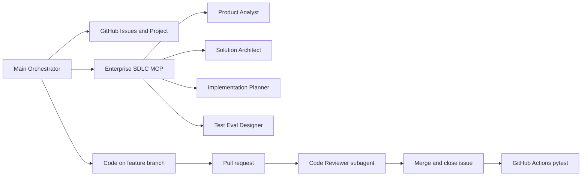

# Delivery record — v0.1 close-out

| Field | Value |
|---|---|
| **Purpose** | Index how this repo was delivered for portfolio readers; not a substitute for GitHub Issues/PRs |
| **Added** | 2026-07-03, after [v0.1.0](https://github.com/raghuram-chittibomma/support-ticket-triage-assistant/releases/tag/v0.1.0) |
| **Source of truth for status** | [GitHub Issues](https://github.com/raghuram-chittibomma/support-ticket-triage-assistant/issues) and [Project board](https://github.com/users/raghuram-chittibomma/projects) |

This document consolidates delivery facts that already exist in git history and GitHub. It was written at milestone close-out so a reviewer does not have to reconstruct the SDLC story from twelve separate PR descriptions.

## What was being demonstrated

The **primary portfolio artifact** is the delivery process: GitHub-first backlog, thin vertical slices, independent agent review, tests + evals, CI, release. The NorthPeak Audioworks triage demo is the vehicle, not the thesis.

## Two programs in one repository

| Program | Milestone / label | Outcome |
|---------|-------------------|---------|
| **Triage product demo** | `v0.1 SDLC Demo` | Pipeline, API, Gradio UI, eval runner — [release v0.1.0](https://github.com/raghuram-chittibomma/support-ticket-triage-assistant/releases/tag/v0.1.0) |
| **Enterprise SDLC MCP** | `program:enterprise-sdlc` | Reusable build-time agents/skills via MCP — [PR #51](https://github.com/raghuram-chittibomma/support-ticket-triage-assistant/pull/51); extracted to its own repo 2026-07-31 ([ADR-003](../01_architecture/DECISIONS/ADR-003-extract-enterprise-sdlc-mcp.md)) |

The MCP program was spun up mid-stream (2026-07-03) and dogfooded for pre-merge review from [PR #53](https://github.com/raghuram-chittibomma/support-ticket-triage-assistant/pull/53) onward. It outgrew this repo once a second real project ([`supportrouter-aws`](https://github.com/raghuram-chittibomma/supportrouter-aws)) started consuming the same catalog — see [Enterprise SDLC MCP extraction](#enterprise-sdlc-mcp-extraction-2026-07-31) below.

## Timeline (from git)

| Date | Event |
|------|-------|
| 2026-07-02 | SDLC foundation commit; story layer; independent review rule |
| 2026-07-02 | Slices 1–2 merged ([#38](https://github.com/raghuram-chittibomma/support-ticket-triage-assistant/pull/38), [#40](https://github.com/raghuram-chittibomma/support-ticket-triage-assistant/pull/40)) |
| 2026-07-03 | Slices 3–7 merged ([#42](https://github.com/raghuram-chittibomma/support-ticket-triage-assistant/pull/42)–[#46](https://github.com/raghuram-chittibomma/support-ticket-triage-assistant/pull/46)) |
| 2026-07-03 | Enterprise SDLC MCP v1 ([#51](https://github.com/raghuram-chittibomma/support-ticket-triage-assistant/pull/51)); eval suite ([#52](https://github.com/raghuram-chittibomma/support-ticket-triage-assistant/pull/52)); CI ([#54](https://github.com/raghuram-chittibomma/support-ticket-triage-assistant/pull/54)); release ([#55](https://github.com/raghuram-chittibomma/support-ticket-triage-assistant/pull/55)) |
| 2026-07-03 | Tag `v0.1.0` published |
| 2026-07-31 | Portfolio share phases 1–2 merged ([#57](https://github.com/raghuram-chittibomma/support-ticket-triage-assistant/pull/57), [#58](https://github.com/raghuram-chittibomma/support-ticket-triage-assistant/pull/58)) |
| 2026-07-31 | Enterprise SDLC MCP extracted to its own repo ([issue #65](https://github.com/raghuram-chittibomma/support-ticket-triage-assistant/issues/65), [ADR-003](../01_architecture/DECISIONS/ADR-003-extract-enterprise-sdlc-mcp.md)) |

**Calendar span:** two days of active delivery (foundation + ten product/delivery slices + MCP program), single orchestrator with build-time agent roles.

## Delivery metrics (merged PRs on `main`, as of 2026-07-03)

| Metric | Value |
|--------|-------|
| Merged PRs (product + delivery + MCP) | 12 |
| Product slices (application code) | 7 (#38–#46) |
| Post-slice infrastructure | eval (#52), CI (#54), release (#55) |
| Process correction PR | #53 (MCP review path over ad-hoc Bugbot) |
| Fast pytest suite | 271 at `v0.1.0` tag; 273 after portfolio close-out (#56 adds fixture baseline tests) |
| Independent Code Reviewer | Every merge PR; blocking bugs found in #40, #42, #43 (see `RELEASE_NOTES.md`) |

## Agent orchestration (build-time)

```mermaid
flowchart LR
  MO["Main Orchestrator"] --> GH["GitHub Issues and Project"]
  MO --> MCP["Enterprise SDLC MCP"]
  MCP --> PA["Product Analyst"]
  MCP --> SA["Solution Architect"]
  MCP --> IP["Implementation Planner"]
  MCP --> TED["Test Eval Designer"]
  MO --> CODE["Code on feature branch"]
  CODE --> PR["Pull request"]
  PR --> CR["Code Reviewer subagent"]
  CR --> MERGE["Merge and close issue"]
  MERGE --> CI["GitHub Actions pytest"]
```

Roles are advisory except the orchestrator (implementation) and the Code Reviewer (fresh-context gate). See `AGENTS.md` and `docs/01_architecture/ENTERPRISE_SDLC_MCP.md`.

## Quality gates at v0.1.0

| Gate | Mechanism | Blocking? |
|------|-----------|-----------|
| Lint | `ruff check .` | Yes (CI, same job as pytest) |
| Deterministic logic | `pytest -m "not llm"` | Yes (CI) |
| Fixture eval baseline | `evals/baselines/v0.1.0/fixture-baseline.json` | Yes (CI, from this close-out) |
| Live LLM eval | `evals/baselines/v0.1.0/live-baseline.json` | No — manual refresh; recorded 2026-07-03 (`gpt-4o-mini`) |
| Pre-merge review | Enterprise SDLC MCP Code Reviewer | Process (documented) |
| Branch protection | **pytest (fast suite)** required on `main` | Yes (GitHub, 2026-07-03) |

**Live baseline (v0.1.0):** category/priority/missing-fields 100%; rubric check pass rate 99.2% (24/25 fully passed). Meets [`QUALITY_BAR.md`](../../evals/baselines/QUALITY_BAR.md). One rubric nit on `TCK-0018` (`addresses_stated_issue`) — see `live-baseline.md`.

## Enterprise SDLC MCP extraction (2026-07-31)

The Enterprise SDLC MCP catalog was built and vendored in this repo ([PR #51](https://github.com/raghuram-chittibomma/support-ticket-triage-assistant/pull/51)), which anticipated eventual extraction once a second consumer existed (`docs/01_architecture/ENTERPRISE_SDLC_MCP.md`). That happened: a separate portfolio project, [`supportrouter-aws`](https://github.com/raghuram-chittibomma/supportrouter-aws), started consuming the same catalog — but by pointing its `.cursor/mcp.json` directly at this repo's own `.venv` and folder path, a fragile cross-repo coupling that would break if this repo moved.

Resolution ([issue #65](https://github.com/raghuram-chittibomma/support-ticket-triage-assistant/issues/65), [ADR-003](../01_architecture/DECISIONS/ADR-003-extract-enterprise-sdlc-mcp.md)):

- Extracted `enterprise_sdlc_mcp/` with git history (`git subtree split`) into [`enterprise-sdlc-mcp`](https://github.com/raghuram-chittibomma/enterprise-sdlc-mcp), packaged as a proper installable Python package (`pyproject.toml`, console-script entry point, own test suite, own CI), tagged `v0.1.0`.
- This repo now installs it editable (`pip install -e ../enterprise-sdlc-mcp`) into its own `.venv`; `.cursor/mcp.json` runs it with no `PYTHONPATH` or cross-repo path.
- Nine catalog skills that existed only on local disk (added for `supportrouter-aws`'s AWS/eval stack, never committed) were committed to git history before extraction so nothing was lost.
- Fast pytest suite: 266 (down from 273 — the 7 MCP-catalog tests moved to the new repo's own suite).

## Backlog shape

Requirements trace FR1–FR8 → user stories → technical tasks (`docs/00_project/PRODUCT_BRIEF.md`). Enabler epic [#29](https://github.com/raghuram-chittibomma/support-ticket-triage-assistant/issues/29) for synthetic data/schema. Deferred follow-ups: [#39](https://github.com/raghuram-chittibomma/support-ticket-triage-assistant/issues/39) (missing-info hardening), [#41](https://github.com/raghuram-chittibomma/support-ticket-triage-assistant/issues/41) (doc nit).

## Known gaps vs AI-native production

Honest scope boundary for portfolio readers comparing this repo to a staffed AI platform team. These are **documented deferrals**, not oversights.

| Area | v0.1 portfolio | Typical AI-native production | Planned for v0.1.x? |
|------|----------------|------------------------------|---------------------|
| Code review gate | Orchestrator-triggered MCP Code Reviewer (fresh context in IDE) | Often bot + human; sometimes required check | No — by design for this demo; automating full agent review in Actions is v0.2+ |
| Live eval in CI | Fixture baseline every PR; live snapshot at release | Live or sampled eval on schedule / pre-release | Optional manual `workflow_dispatch` later |
| CI checks | pytest + ruff + Dependabot | + types, secrets scan, SAST | ruff + Dependabot added; mypy/secret scan deferred |
| LLM observability | None (OpenAI client is a thin seam) | Token/cost/latency tracing (e.g. LangSmith) | Deferred — runtime story, not SDLC thesis |
| Release automation | Hand-cut tag + release notes | release-please / semantic-release | Deferred — v0.1.0 was intentional close-out |
| Staging / promotion | Single track: PR → `main` | dev → staging → prod | Out of scope per charter (no deployment) |
| Adversarial evals | Synthetic happy-path tickets only | Prompt-injection / jailbreak suites | Deferred unless targeting safety roles |

**Takeaway:** This repo demonstrates **delivery discipline** (backlog, slices, review, tests, evals, CI, branch protection). Closing the automation gaps above would strengthen a **platform/MLOps** narrative — a different portfolio emphasis.

## Owner actions not captured in git

1. ~~**Branch protection**~~ — done (2026-07-03): **pytest (fast suite)** required on `main`
2. ~~**Live eval snapshot**~~ — done (2026-07-03): [`live-baseline.json`](../../evals/baselines/v0.1.0/live-baseline.json) under `evals/baselines/v0.1.0/`
3. **Demo recording** — short screen capture of `python -m src.ui` linked from README or GitHub Release

## Related docs

- [`PORTFOLIO_TOUR.md`](PORTFOLIO_TOUR.md) — guided path for external reviewers (start here when sharing)
- [ADR-003](../01_architecture/DECISIONS/ADR-003-extract-enterprise-sdlc-mcp.md) — Enterprise SDLC MCP extraction to its own repo
- [`AI_ORCHESTRATOR_BRIEF.md`](AI_ORCHESTRATOR_BRIEF.md) — operating rules for agents
- [`RELEASE_NOTES.md`](../03_operations/RELEASE_NOTES.md) — per-slice factual log (includes reviewer findings)
- [`evals/baselines/README.md`](../../evals/baselines/README.md) — baseline policy
- [`EVAL_STRATEGY.md`](../02_testing/EVAL_STRATEGY.md) — when and how evals run
