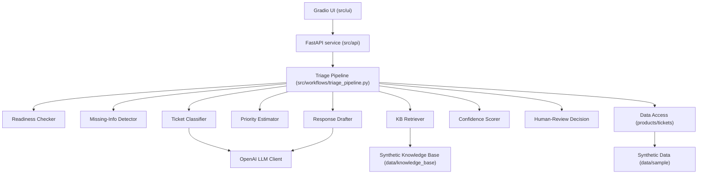

# Architecture — Support Ticket Triage Assistant

Status: v0.1 (Option A — Simple architecture). See `docs/01_architecture/DECISIONS/ADR-001-architecture-choice.md` for the decision record and alternative considered.

## Architecture Diagram

## Layers

- **UI layer** (`src/ui/`): Gradio app for manual demo use; calls the API layer (or the pipeline directly in-process for the simplest v0.1 wiring).
- **API/service layer** (`src/api/`): FastAPI app exposing `POST /triage`, request/response validated via Pydantic schemas.
- **Schemas** (`src/schemas/`): `TicketInput`, `TriageResult`, `Category`, `Priority`, `ReadinessResult`, `Reference`.
- **Ticket readiness checker** (`src/services/readiness.py`): deterministic — does the ticket contain enough information to triage confidently?
- **Missing information detector** (`src/services/missing_info.py`): deterministic, per-category required-field rules (e.g. Wi-Fi issues need product model + network type + firmware version).
- **Ticket classifier** (`src/services/classifier.py`): keyword/rule pre-filter plus an OpenAI call for category confirmation and a human-readable explanation.
- **Priority estimator** (`src/services/priority.py`): deterministic rules based on safety keywords, functional impact, urgency language, and time sensitivity.
- **Knowledge retrieval layer** (`src/retrieval/kb_retriever.py`): keyword/tag-based matching over the synthetic knowledge base (no vector database in v0.1).
- **Response drafting layer** (`src/services/response_drafter.py`): OpenAI call that drafts a customer response grounded in retrieved references.
- **Confidence scoring** (`src/services/confidence.py`): deterministic combination of classifier confidence, readiness, and retrieval match strength.
- **Human-review decision logic** (`src/services/human_review.py`): deterministic threshold and escalation-keyword gate.
- **Evaluation layer** (`evals/`): scenario runner comparing pipeline output to expected ground truth in the synthetic ticket dataset.
- **Test layer** (`tests/`): pytest unit tests per service plus integration tests for the pipeline and API.
- **Configuration layer** (`src/config.py`): pydantic-settings for the OpenAI key, data file paths, and rule thresholds.
- **PostgreSQL layer**: not present in v0.1 (see ADR-001 and the Data Model doc for the reserved forward-looking schema).

## Extension seams (for v0.2+, not built in v0.1)

To avoid a rewrite later, v0.1 code is written behind small interfaces:

- `LLMClient` — wraps the OpenAI call; a future provider can implement the same interface.
- `Retriever` — wraps keyword retrieval; a future `ChromaRetriever` can implement the same interface for semantic search.
- `TriageRepository` — not implemented in v0.1; a future PostgreSQL-backed implementation can persist tickets/results/audit trail without changing the pipeline's calling code.
- `triage_pipeline.py` is a plain function/class today; if the workflow gains branching or looping (e.g. iterative clarification), it can be reimplemented as a LangGraph graph without changing the service/API layer's contract.

## Runtime Workflow

See `docs/01_architecture/DATA_MODEL.md` for schemas and `docs/00_project/PRODUCT_BRIEF.md` for functional requirements. Workflow sequence:

Ticket intake → input validation → readiness check → missing-information detection → category classification → priority estimation → knowledge-base retrieval (if applicable) → response drafting → confidence scoring → human-review decision → output formatting.

No persistence step occurs in v0.1; a persistence extension point is documented but unimplemented.
