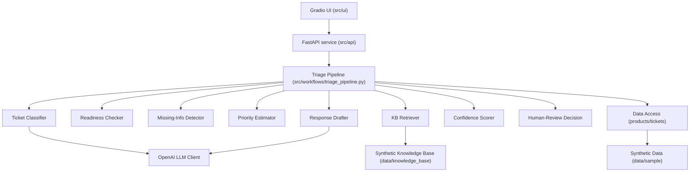

# Architecture — Support Ticket Triage Assistant

Status: v0.1 (Option A — Simple architecture). See `docs/01_architecture/DECISIONS/ADR-001-architecture-choice.md` for the decision record and alternative considered.

## Architecture Diagram

## Layers

- **UI layer** (`src/ui/`, implemented in Slice 7): Gradio app (`src/ui/app.py`) for manual demo use. **v0.1 wiring choice:** calls `run_triage_pipeline()` in-process rather than the FastAPI `/triage` endpoint — keeps the demo to a single `python -m src.ui` command with no separate uvicorn process. The HTTP API (`src/api/`) remains available for programmatic clients and integration tests. The architecture diagram below shows the logical separation (UI → API → Pipeline); in v0.1 the UI short-circuits directly to the pipeline for demo simplicity.
- **API/service layer** (`src/api/`, implemented in Slice 6): FastAPI app (`src/api/main.py`) exposing `POST /triage` (request/response validated via `TicketInput`/`TriageResult`) and `GET /health`. The `/triage` path operation is a plain `def`, not `async def` — `run_triage_pipeline` makes blocking HTTP calls internally, and FastAPI automatically runs synchronous path operations in an external threadpool rather than on the event loop, so no extra async plumbing is needed. A dedicated `MissingAPIKeyError` (a `RuntimeError` subclass, `src/llm/client.py`) exception handler converts `OpenAILLMClient`'s missing-API-key error into a clear 500 response — scoped to this specific configuration-error type, not a bare `RuntimeError`, so an unrelated bug elsewhere can't be silently masked as a "missing key" problem.
- **Schemas** (`src/schemas/`): `TicketInput`, `TriageResult`, `Category`, `Priority`, `ReadinessResult`, `Reference`.
- **Ticket classifier** (`src/services/classifier.py`, implemented in Slice 2): deterministic keyword/product-hint pre-filter (`rank_categories`) plus an `LLMClient` call for category confirmation and a human-readable explanation. `category_confidence` is a deterministic function of pre-filter/LLM agreement, not a further model call. Runs before readiness/missing-info detection (see Runtime Workflow note below).
- **Ticket readiness checker** (`src/services/readiness.py`): deterministic — does the ticket contain enough information to triage confidently for its classified category?
- **Missing information detector** (`src/services/missing_info.py`): deterministic, per-category required-field rules (e.g. Wi-Fi issues need product model + network type + firmware version).
- **Priority estimator** (`src/services/priority.py`, implemented in Slice 2): deterministic, ordered keyword rule list based on safety keywords, functional impact, urgency/escalation language, and informational/cosmetic signals (see `DATA_MODEL.md` Sections 3-4). No LLM call.
- **Knowledge retrieval layer** (`src/retrieval/kb_retriever.py`, implemented in Slice 3): `KeywordKBRetriever` filters KB articles by `category_tags` matching the classified category (the primary relevance signal — categories with no KB coverage correctly return zero references), then ranks same-category candidates by deterministic keyword-overlap + product-tag scoring. No vector database in v0.1.
- **Response drafting layer** (`src/services/response_drafter.py`, implemented in Slice 3, extended in Slice 5): a single `LLMClient` call that produces a structured `DraftResult` — a diagnosis (`likely_issue`), a recommended next step for the support agent (`suggested_next_action`), and a customer-facing reply (`suggested_response`) grounded in retrieved references. `likely_issue`/`suggested_next_action` have no dedicated backlog item of their own (`PRODUCT_BRIEF.md`'s FR8 only lists them as part of the aggregate result), so they're produced in this same call rather than a second one, per NFR5 (interactive-demo latency). A deterministic post-generation check rejects (falls back on) the whole draft if any field cites a `doc_id` not actually present in the retrieved references, so a citation can never be fabricated even if the model ignores its instructions.
- **Confidence scoring** (`src/services/confidence.py`, implemented in Slice 4): deterministic combination of classifier confidence, readiness, and retrieval match strength (see `DATA_MODEL.md` Section 12 for the exact formula/thresholds). No LLM call.
- **Human-review decision logic** (`src/services/human_review.py`, implemented in Slice 4): deterministic threshold and escalation-keyword gate (see `DATA_MODEL.md` Section 13). Urgent priority and escalation language always flag review regardless of other signals. No LLM call.
- **Triage pipeline orchestration** (`src/workflows/triage_pipeline.py`, implemented in Slice 5): the single entry point (`run_triage_pipeline`) that sequences every service above into one `TriageResult`, per the Runtime Workflow order below. A plain function, per ADR-001 — no LangGraph in v0.1. `llm_client`/`retriever` are injectable (defaulting to `OpenAILLMClient`/`KeywordKBRetriever`), so callers (tests, the API layer) can swap them without touching this function.
- **Evaluation layer** (`evals/`): scenario runner comparing pipeline output to expected ground truth in the synthetic ticket dataset.
- **Test layer** (`tests/`): pytest unit tests per service plus integration tests for the pipeline and API.
- **Configuration layer** (`src/config.py`, implemented in Slice 2): `pydantic-settings` `Settings` object reading `OPENAI_API_KEY` and `OPENAI_MODEL` from the environment/`.env` (see `.env.example`). Never required for deterministic components or for tests, which mock the `LLMClient` interface.
- **LLM client layer** (`src/llm/client.py`, implemented in Slice 2): `LLMClient` Protocol plus the default `OpenAILLMClient` implementation, constructed lazily so importing the module never requires an API key.
- **PostgreSQL layer**: not present in v0.1 (see ADR-001 and the Data Model doc for the reserved forward-looking schema).

## Extension seams

To avoid a rewrite later, v0.1 code is written behind small interfaces:

- `LLMClient` (implemented, `src/llm/client.py`) — wraps the OpenAI call; a future provider can implement the same Protocol without touching `classifier.py` or `response_drafter.py`.
- `Retriever` (implemented, `src/retrieval/kb_retriever.py`) — wraps keyword retrieval; a future `ChromaRetriever` can implement the same Protocol for semantic search without changing callers.
- `TriageRepository` — not implemented in v0.1; a future PostgreSQL-backed implementation can persist tickets/results/audit trail without changing the pipeline's calling code.
- `triage_pipeline.py` (implemented, `src/workflows/triage_pipeline.py`) is a plain function today; if the workflow gains branching or looping (e.g. iterative clarification), it can be reimplemented as a LangGraph graph without changing the service/API layer's contract.

## Runtime Workflow

See `docs/01_architecture/DATA_MODEL.md` for schemas and `docs/00_project/PRODUCT_BRIEF.md` for functional requirements. Workflow sequence:

Ticket intake → input validation → category classification → readiness check → missing-information detection → priority estimation → knowledge-base retrieval (if applicable) → response drafting → confidence scoring → human-review decision → output formatting.

**Note (revised during Slice 1 implementation of #14/#15):** classification runs *before* readiness/missing-information detection, not after as originally sketched — the per-category required-field rules in `DATA_MODEL.md` Section 5 need to know the category to know which fields to check for. `readiness.py` and `missing_info.py` both take the classified `Category` as an explicit parameter alongside the `TicketInput`, keeping them deterministic, unit-testable in isolation, and unaware of how the category was produced.

No persistence step occurs in v0.1; a persistence extension point is documented but unimplemented.
